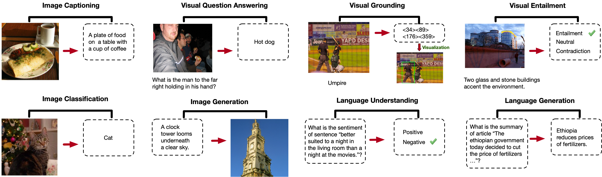

# OFA

[[Paper]](http://arxiv.org/abs/2202.03052) [Blog] [[Colab](colab.md)] [[Spaces](spaces.md)]



OFA is a unified multimodal pretrained model that unifies modalities (i.e., cross-modality, vision, language) and tasks 
(e.g., image generation, visual grounding, image captioning, image classification, text generation, etc.) 
to a simple sequence-to-sequence learning framework. For more information, please refer to our paper: [Unifying Architectures, Tasks, and Modalities Through a Simple Sequence-to-Sequence Learning Framework](http://arxiv.org/abs/2202.03052).


## News
* 2022.2.15: Released finetuning & inference code/checkpoints for referring expression comprehension, as well as a Colab notebook [![][colab]](https://colab.research.google.com/drive/1AHQNRdaUpRTgr3XySHSlba8aXwBAjwPB?usp=sharing) and a demo in Hugging Face Spaces [](https://huggingface.co/spaces/OFA-Sys/OFA-Visual_Grounding).
* 2022.2.13: Released the demo of image captioning. Have fun! [](https://huggingface.co/spaces/OFA-Sys/OFA-Image_Caption)
* 2022.2.11: Released the Colab notebook for image captioning [![][colab]](https://colab.research.google.com/drive/1Q4eNhhhLcgOP4hHqwZwU1ijOlabgve1W?usp=sharing). Enjoy! 
* 2022.2.11: Released the pretrained checkpoint of OFA-Large and the complete (2-staged) finetuning code for image captioning.
* 2022.2.10: Released the inference code & finetuned checkpoint for image captioning, which can reproduce **the results on COCO Karparthy test split (149.6 CIDEr)**. OFA also achieves No.1 on the COCO image captioning online leaderboard [[Link](https://competitions.codalab.org/competitions/3221#results)] (marked as M6-Team)

[colab]: <https://colab.research.google.com/assets/colab-badge.svg>

## TODO
* To release finetuning and inference codes for multimodal downstream tasks soon, including image captioning, VQA, text-to-image generation, SNLI-VE, Referring expression, comprehension, etc. 
* To release codes for pretraining soon.


## Approach


## Requirements
* python 3.7.4
* pytorch 1.8.1
* torchvision 0.9.1
* JAVA 1.8 (for COCO evaluation)


## Installation
```bash
git clone https://github.com/OFA-Sys/OFA
pip install -r requirements.txt
```


## Datasets and Checkpoints
See [datasets.md](datasets.md) and [checkpoints.md](checkpoints.md).


## Pretraining
To release soon:)


# Finetuning & Inference
Below we provide methods for fintuning and inference on different downstream tasks.
## Caption
1. Download data (see [datasets.md](datasets.md)) and models (see [checkpoints.md](checkpoints.md)) and put them in the correct directory
2. Train
```bash
cd run_scripts/caption
nohup sh train_caption_stage1.sh > train_stage1.out &  # stage1, train with cross-entropy loss
nohup sh train_caption_stage2.sh > train_stage2.out &  # stage2, load the best ckpt of stage1 and train with CIDEr optimization 
```
3. Inference
```bash
cd run_scripts/caption ; sh evaluate_caption.sh  # inference & evaluate
```

## Referring Expression Comprehension 
1. Download data (see [datasets.md](datasets.md)) and models (see [checkpoints.md](checkpoints.md)) and put them in the correct directory
2. Train
```bash
cd run_scripts/refcoco
nohup sh train_refcoco.sh > train_refcoco.out &  # finetune for refcoco
nohup sh train_refcocoplus.sh > train_refcocoplus.out &  # finetune for refcoco+
nohup sh train_refcocog.sh > train_refcocog.out &  # finetune for refcocog
```
3. Inference
```bash
cd run_scripts/refcoco ; sh evaluate_refcoco.sh  # inference & evaluate for refcoco/refcoco+/refcocog
```

# Gallery
Below we provide examples of OFA in text-to-image generation and open-ended VQA. Also, we demonstrate its performance in unseen task (Grounded QA) as well as unseen domain (Visual Grounding on images from unseen domains). 

## Text-to-Image Generation (normal query)


## Text-to-Image Generation (counterfactual query)


## Open-Ended VQA


## Grounded QA (unseen task)


## Viusal Grounding (unseen domain)


## Citation
Please cite our paper if you find it helpful :)

```
@article{wang2022OFA,
  title={Unifying Architectures, Tasks, and Modalities Through a Simple Sequence-to-Sequence Learning Framework},
  author={Wang, Peng and Yang, An and Men, Rui and Lin, Junyang and Bai, Shuai and Li, Zhikang and Ma, Jianxin and Zhou, Chang and Zhou, Jingren and Yang, Hongxia},
  journal={arXiv e-prints},
  pages={arXiv--2202},
  year={2022}
}
```


## Related Codebase
* [Fairseq](https://github.com/pytorch/fairseq)


## License
Apache-2.0
