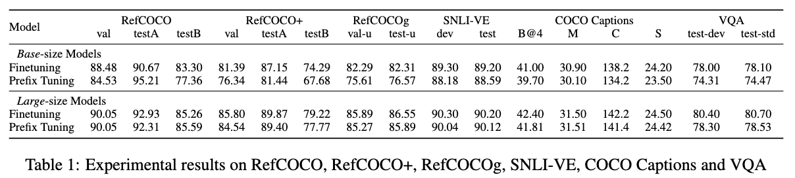

<!---
Copyright 2022 The OFA-Sys Team. 
All rights reserved.
This source code is licensed under the Apache 2.0 license found in the LICENSE file in the root directory.
-->

#Multimodal Prompt Tuning 

This is the code to reproduce the experiments from the paper "Multimodal Prompt Tuning for Unified Sequence-to-Sequence Learning". This paper explores prompting methods for multimodal pretraining, and specifically focuses on the unified sequence-to-sequence learning framework instead of the constrastive learning models. We investigate a series of parameter-efficient tuning methods, and demonstrate that light-weight prompt tuning can achieve comparable performance with finetuning with a much fewer computation costs.
    
<br></br>


# Results
Experimental results on RefCOCO, RefCOCO+, RefCOCOg, SNLI-VE, COCO Captions and VQA


<br></br>

# Requirements
* python 3.7.4
* pytorch 1.8.1
* torchvision 0.9.1
* JAVA 1.8 (for COCO evaluation)
<br></br>

# Installation
```bash
pip install -r requirements.txt
```
<br></br>

# Datasets and Checkpoints
See [datasets.md](datasets.md) and [checkpoints.md](checkpoints.md).
<br></br>


# Training
We provide a demo script (`run_scripts/refcoco/train_refcoco_prefix.sh`) that has all the required parts for training.

```sh
./run_scripts/refcoco/train_refcoco_prefix.sh
```
A few options of note:
*   `--encoder-prompt` :: whether to insert prompts to the encoder
*   `--decoder-prompt` :: whether to insert prompts to the decoder
*   `--encoder-prompt-length` :: encoder prompt length
*   `--decoder-prompt-length` :: decoder prompt length
*   `--bitfit` :: whether to use bitfit
*   `--adapter` :: whether to use adapter
*   `--adapter-dim` :: adapter projection dim

We recommend that your workspace directory should be organized like this: 
```
OFA/
├── checkpoints/
│   ├── ofa_base.pt
│   ├── ofa_large.pt
│   └── ...
├── criterions/
├── data/
├── dataset/
│   ├── caption_data/
│   ├── refcoco_data/
│   └── ...
├── fairseq/
├── models/
├── run_scripts/
├── tasks/
├── train.py
├── trainer.py
└── utils/
```

<br></br>
