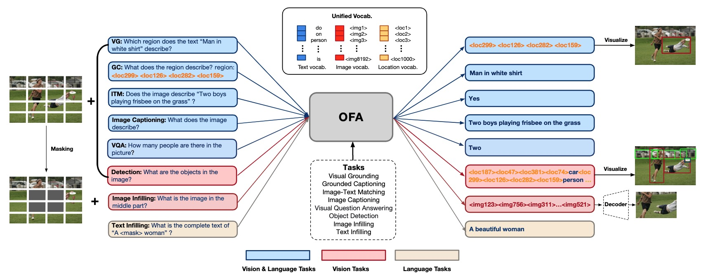
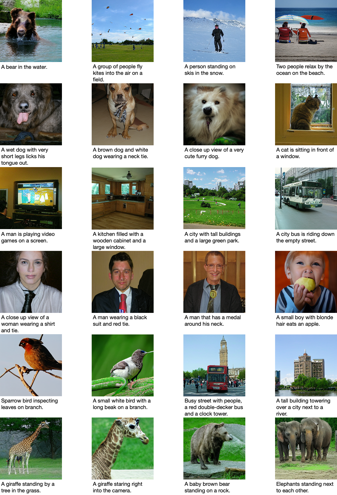
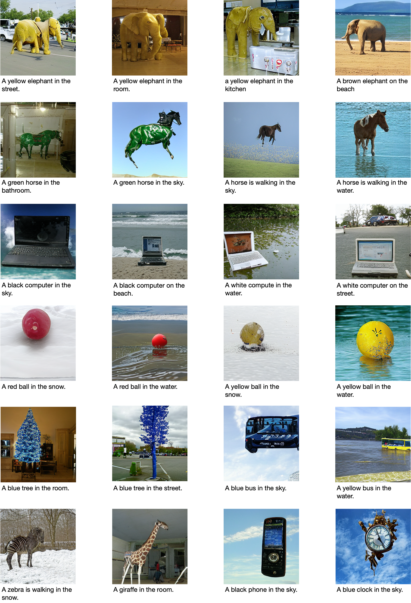

<!---
Copyright 2022 The OFA-Sys Team. 
All rights reserved.
This source code is licensed under the Apache 2.0 license found in the LICENSE file in the root directory.
-->

<p align="center">
    <br>
    
    <br>
<p>
<p align="center">
    <a href="https://github.com/huggingface/transformers/blob/master/LICENSE">
        
    </a>
    <a href="https://huggingface.co/ofa-sys">
        
    </a>
    <a href="colab.md"></a>
</p>

<h4 align="center">
    <p>
        <a href="http://arxiv.org/abs/2202.03052">Paper</a> |
        <b>Blog</b>
    <p>
</h4>
<br></br>

<p align="center">
    <br>
    
    <br>
<p>


OFA is a unified multimodal pretrained model that unifies modalities (i.e., cross-modality, vision, language) and tasks 
(e.g., image generation, visual grounding, image captioning, image classification, text generation, etc.) 
to a simple sequence-to-sequence learning framework. For more information, please refer to our paper: [Unifying Architectures, Tasks, and Modalities Through a Simple Sequence-to-Sequence Learning Framework](http://arxiv.org/abs/2202.03052).
<br></br>


# Online Demos
We provide online demo via Hugging Face Spaces for you to interact with our pretrained and finetuned models. Below are the links to the demos:
* [Image Captioning](https://huggingface.co/spaces/OFA-Sys/OFA-Image_Caption)
* [Text-to-Image Generation](https://huggingface.co/spaces/OFA-Sys/OFA-Text2Image_Generation)
* [Visual Grounding](https://huggingface.co/spaces/OFA-Sys/OFA-Visual_Grounding)
* [Visual Question Answering](https://huggingface.co/spaces/OFA-Sys/OFA-Visual_Question_Answering)

Also we provide Colab notebooks for you to better perceive the procedures. Click [here](colab.md) to check them out!
<br></br>

# News
* 2022.3.03: Released the finetuning & inference code/checkpoints for SNLI-VE and GLUE.
* 2022.2.23: Based on pretrained OFA, an interactive demo of **Visual Question Answering** is ready! Check it out in [Huggingface Spaces](https://huggingface.co/spaces/OFA-Sys/OFA-Visual_Question_Answering)!
* 2022.2.22: Released the finetuning & inference code/checkpoints for VQA, which can reproduce **the reported VQA accuracy in OFA paper (80.02 on test-std)**. We believe much accuracy improvement can still be achieved based on this codebase. Recently we have used this codebase to achieve a better result **(80.45 on test-std)** on the [VQA Challenge](https://eval.ai/web/challenges/challenge-page/830/leaderboard/2278).
* 2022.2.18: Interactive Demo of **Text-to-Image Generation** is ready! Check it out in [Huggingface Spaces](https://huggingface.co/spaces/OFA-Sys/OFA-Text2Image_Generation)!
* 2022.2.15: Released finetuning & inference code/checkpoints for referring expression comprehension, as well as a [Colab notebook](https://colab.research.google.com/drive/1AHQNRdaUpRTgr3XySHSlba8aXwBAjwPB?usp=sharing) and a demo in [Hugging Face Spaces](https://huggingface.co/spaces/OFA-Sys/OFA-Visual_Grounding).
* 2022.2.13: Released the demo of image captioning on [Hugging Face Spaces](https://huggingface.co/spaces/OFA-Sys/OFA-Image_Caption). Have fun!
* 2022.2.11: Released the [Colab notebook](https://colab.research.google.com/drive/1Q4eNhhhLcgOP4hHqwZwU1ijOlabgve1W?usp=sharing) for image captioning. Enjoy! 
* 2022.2.11: Released the pretrained checkpoint of OFA-Large and the complete (2-stage) finetuning code for image captioning.
* 2022.2.10: Released the inference code & finetuned checkpoint for image captioning, which can reproduce **the results on COCO Karparthy test split (149.6 CIDEr)**. OFA also achieves No.1 on the COCO image captioning online leaderboard [[Link](https://competitions.codalab.org/competitions/3221#results)] (marked as M6-Team).

[colab]: <https://colab.research.google.com/assets/colab-badge.svg>
<br></br>

# TODO
* [x] To release finetuning and inference codes for multimodal downstream tasks soon, including image captioning, VQA, text-to-image generation, SNLI-VE, referring expression, comprehension, etc. 
* [ ] To release finetuning and inference codes for unimodal downstream tasks soon. 
* [ ] To release codes for pretraining soon.
* [ ] To integrate more downstream tasks concerning more modalities to our OFA framework.
<br></br>

# Approach


# Results
<table border="1" width="100%">
    <tr align="center">
        <th>Task</th><th>Image Captioning</th><th colspan="3">Text-to-Image Generation</th><th colspan="2">VQA</th><th colspan="2">Visual Entailment</th><th colspan="8">Referring Expression Comprehension</th>
    </tr>
    <tr align="center">
        <td>Dataset</td><td>COCO</td><td colspan="3">COCO</td><td colspan="2">VQA v2</td><td colspan="2">SNLI-VE</td><td colspan="3">RefCOCO</td><td colspan="3">RefCOCO+</td><td colspan="2">RefCOCOg</td>
    </tr>
    <tr align="center">
        <td>Split</td><td>Kaparthy test</td><td colspan="3">test</td><td>test-dev</td><td>test-std</td><td>val</td><td>test</td><td>val</td><td>test-a</td><td>test-b</td><td>val</td><td>test-a</td><td>test-b</td><td>val-u</td><td>test-u</td>
    </tr>
    <tr align="center">
        <td>Metric</td><td>CIDEr</td><td>FID</td><td>CLIPSIM</td><td>IS</td><td colspan="2">Acc.</td><td colspan="2">Acc.</td><td colspan="8">Acc.</td>
    </tr>
    <tr align="center">
        <td>Score</td><td>150.2</td><td>10.5</td><td>34.4</td><td>31.1</td><td>80.34</td><td>80.45</td><td>90.3</td><td>90.2</td><td>90.05</td><td>92.93</td><td>85.26</td><td>84.49</td><td>90.10</td><td>77.77</td><td>85.54</td><td>85.20</td>
    </tr>
</table>
<br></br>

# Requirements
* python 3.7.4
* pytorch 1.8.1
* torchvision 0.9.1
* JAVA 1.8 (for COCO evaluation)
<br></br>

# Installation
```bash
git clone https://github.com/OFA-Sys/OFA
pip install -r requirements.txt
```
<br></br>

# Datasets and Checkpoints
See [datasets.md](datasets.md) and [checkpoints.md](checkpoints.md).
<br></br>

# Pretraining
To release soon:)
<br></br>

# Finetuning & Inference
Below we provide methods for finetuning and inference on different downstream tasks.
## Image Captioning
1. **Prepare the Dataset & Checkpoints**: Download data (see [datasets.md](datasets.md)) and models (see [checkpoints.md](checkpoints.md)) and put them in the correct directory. The dataset zipfile `caption_data.zip` contains caption_stage1_train.tsv, caption_stage2_train.tsv, caption_val.tsv and caption_test.tsv. Each image corresponds to only 1 caption in `caption_stage1_train.tsv` and corresponds to multiple captions in other TSV files (about 5 captions per image). Each line of the dataset represents a caption sample with the following format. The information of uniq-id, image-id, caption, predicted object labels (taken from [VinVL](https://github.com/pzzhang/VinVL), not used), image base64 string are separated by tabs.
    ```
    162365  12455   the sun sets over the trees beyond some docks.  sky&&water&&dock&&pole  /9j/4AAQSkZJ....UCP/2Q==
    ```
2. **Finetuning**: Following previous standard practice, we divide the finetuning process of image captioning into two stages. In stage 1, we finetune OFA with cross-entropy loss on 4 NVIDIA-V100 GPUs with 32GB memory (expected to obtain ~139.5 CIDEr on the validation set at this stage). In stage 2, we select the best checkpoint of stage 1 and train with CIDEr optimization on 8 NVIDIA-V100 GPUs (expected to get ~149.4 CIDEr on the validation set at this stage).
    ```bash
    cd run_scripts/caption
    nohup sh train_caption_stage1.sh > train_stage1.out &  # stage 1, train with cross-entropy loss
    nohup sh train_caption_stage2.sh > train_stage2.out &  # stage 2, load the best ckpt of stage1 and train with CIDEr optimization 
    ```
3. **Inference**
    ```bash
    cd run_scripts/caption ; sh evaluate_caption.sh  # inference & evaluate
    ```

## Referring Expression Comprehension 
1. **Prepare the Dataset & Checkpoints**: Download data (see [datasets.md](datasets.md)) and models (see [checkpoints.md](checkpoints.md)) and put them in the correct directory. We provide RefCOCO (split by UNC), RefCOCO+ (split by UNC) and RefCOCOg (split by UMD) datasets. See (https://www.tensorflow.org/datasets/catalog/ref_coco) and (https://github.com/lichengunc/refer) for more details. Note that in the original dataset, each region-coord (or bounding box) may corresponds to multiple descriptive texts. We split these texts into multiple samples so that the region-coord in each sample corresponds to only one text. Each line of the processed dataset represents a sample with the following format. The information of uniq-id, image-id, text, region-coord (separated by commas), image base64 string are separated by tabs.
    ```
    79_1    237367  A woman in a white blouse holding a glass of wine.  230.79,121.75,423.66,463.06 9j/4AAQ...1pAz/9k=
    ```
2. **Finetuning**: Unlike the original paper, we finetune OFA with a drop-path rate of 0.2, and found that training with this hyper-parameter achieves better results. We will update the reported results of the paper later.
    ```bash
    cd run_scripts/refcoco
    nohup sh train_refcoco.sh > train_refcoco.out &  # finetune for refcoco
    nohup sh train_refcocoplus.sh > train_refcocoplus.out &  # finetune for refcoco+
    nohup sh train_refcocog.sh > train_refcocog.out &  # finetune for refcocog
    ```
3. **Inference**
    ```bash
    cd run_scripts/refcoco ; sh evaluate_refcoco.sh  # inference & evaluate for refcoco/refcoco+/refcocog
    ```

## Visual Question Answering
Here we provide the finetuning and inference codes to reproduce the VQAv2 result reported in our paper (**test-std 80.02**). We believe much improvement on accuracy can still be achieved based on this codebase :)
1. **Prepare the Dataset & Checkpoints**: Download data (see [datasets.md](datasets.md)) and models (see [checkpoints.md](checkpoints.md)) and put them in the correct directory. The dataset zipfile `vqa_data.zip` is around 100G and the decompressed data costs around 135G disk storage, which contains the training, validation and testing samples together with other necessary data resources. Following common practice, VG-QA samples are also included in the training data. To adapt to the seq2seq paradigm of OFA, we transform original VQA training questions with multiple golden answers into multiple training samples. For the original VQA validation set, we keep around 10k samples for our validation and utilize the other samples for training. Each line of the dataset represents a VQA sample with the following format. The information of question-id, image-id, question, answer (with confidence), predicted object labels (taken from [VinVL](https://github.com/pzzhang/VinVL), slightly brings around +0.1 accuracy improvement), image base64 string are separated by tabs.
    ```
    79459   79459   is this person wearing shorts?  0.6|!+no    house&&short&&...&&sky  /9j/4AAQS...tigZ/9k=
    ```
2. **Shuffle the Training Data** (optional, but achieves better finetuning accuracy): If the disk storage is sufficient, we recommend to prepare the shuffled training data for each epoch in advance. In our experiments, we use shuffling which brings around **+0.3** improvement on VQA accuracy.
    ```bash
    cd dataset/vqa_data
    ln vqa_train.tsv vqa_train_1.tsv
    for idx in `seq 1 9`;do shuf vqa_train_${idx}.tsv > vqa_train_$[${idx}+1].tsv;done # each file is used for an epoch
    ```
3. **Finetuning**: In our experiments, the VQA finetuning is performed on 4 8-A100-GPU servers (_with RDMA_). Here provides the finetuning script `train_vqa_distributed.sh` which supports multi-server distributed training (as well as single-server training). Please refer to the comments in the beginning of the script and set the configs correctly according to your distribution environment. If you have shuffled the training data in the previous step, please correctly specify the training data path following the guide in the script comments. **The command should be run on each worker.** 
    ```bash
    # run on each worker after the distributed and data configs have been correctly set following the guide in train_vqa_distributed.sh 
    cd run_scripts/vqa
    bash train_vqa_distributed.sh 
    ```
    In our experiments, the finetuning costs around 36 hours (for 12 epochs). After each epoch, an evaluation on validation set is performed. The best validation accuracy during finetuning will be around 80.8. The log is saved in `${log_dir}`.
4. **Inference**: We provide 2 types of inference, **beam-search** (much faster but gets sub-optimal accuracy) and **all-candidate evaluation** (slower but best accuracy).
    
    For beam-search inference, use the script `evaluate_vqa_beam.sh`. Refer to the command below. The inference on test set costs around 16 GPU hours. After inference on test set, the result JSON file will be dumped in the `${result_path}` defined in the shell script. You can submit the result `test_predict.json` to [EvalAI](https://eval.ai/web/challenges/challenge-page/830/overview). Using our released finetuned checkpoint, beam-search inference will get 80.15 validation accuracy, 79.36 test-dev accuracy and 79.48 test-std accuracy (around 0.6 lower than all-candidate evaluation).
    ```bash
    cd run_scripts/vqa
    bash evaluate_vqa_beam.sh val # specify 'val' or 'test'
    ```    
    
    For all-candidate evaluation, we recommend to use the distributed script `evaluate_vqa_allcand_distributed.sh`. Please refer to the guide in the script to set the distributed configs before running. The result JSON file will be dumped in the `${result_path}` defined in the shell script of rank-0 server. All-candidate evaluation computes scores on all the candidate answers in the VQA dataset, which achieves **80.82 validation accuracy, 79.87 test-dev accuracy and 80.02 test-std accuracy**, reproducing our reported results in the paper. However, the inference on test set costs around 1k GPU hours, which is much slower.
    ```bash
    # run on each worker after the distributed configs have been correctly set following the guide in evaluate_vqa_allcand_distributed.sh
    cd run_scripts/vqa
    bash evaluate_vqa_allcand_distributed.sh val # specify 'val' or 'test'
    ```   

## Visual Entailment
1. **Prepare the Dataset & Checkpoints**: Download data (see [datasets.md](datasets.md)) and models (see [checkpoints.md](checkpoints.md)) and put them in the correct directory. Each line of the processed dataset represents a sample with the following format. The information of uniq-id, image-id, image base64 string, hypothesis, caption (or text premise), label are separated by tabs.
    ```
    252244149.jpg#1r1n  252244149   /9j/4AAQ...MD/2Q==   a man in pink and gold is chewing on a wooden toothpick.   a man in pink is chewing a toothpick on the subway.   neutral 
    ```
2. **Finetuning**: In our experiments, the SNLI-VE finetuning is performed on 8 NVIDIA-V100 GPUs with 32GB memory. In this task, we experimented with only a few sets of hyperparameters. We believe that proper hyperparameter tuning can lead to further accuracy improvement.
    ```bash
    cd run_scripts/snli_ve
    nohup sh train_snli_ve.sh > train_snli_ve.out &  # finetune for snli_ve
    ```
3. **Inference**
    ```bash
    cd run_scripts/snli_ve ; sh evaluate_snli_ve.sh  # inference & evaluate for snli_ve
    ```   
   
## GLUE
1. **Prepare the Dataset & Checkpoints**: Download data (see [datasets.md](datasets.md)) and models (see [checkpoints.md](checkpoints.md)) and put them in the correct directory. we provide 7 language understanding datasets from GLUE benchmark, including COLA, MNLI, MRPC, QNLI, QQP, RTE and SST2. More details about these datasets can be found in  (https://openreview.net/pdf?id=rJ4km2R5t7)
2. **Finetuning**: For each task, we have tried multiple sets of hyperparameters (including learning rate, batch size, training epochs). The results under different sets of hyperparameters can be found in `${log_dir}`.
    ```bash
    cd run_scripts/glue
    nohup sh train_cola.sh > train_cola.out &  # finetune for cola
    nohup sh train_mnli.sh > train_mnli.out &  # finetune for mnli
    nohup sh train_mrpc.sh > train_mrpc.out &  # finetune for mrpc
    nohup sh train_qnli.sh > train_qnli.out &  # finetune for qnli
    nohup sh train_qqp.sh > train_qqp.out &  # finetune for qqp
    nohup sh train_rte.sh > train_rte.out &  # finetune for rte
    nohup sh train_sst2.sh > train_sst2.out &  # finetune for sst2
    ```
<br></br>

# Gallery
Below we provide examples of OFA in text-to-image generation and open-ended VQA. Also, we demonstrate its performance in unseen task (Grounded QA) as well as unseen domain (Visual Grounding on images from unseen domains). 

## Text-to-Image Generation (normal query)


## Text-to-Image Generation (counterfactual query)


## Open-Ended VQA


## Grounded QA (unseen task)


## Visual Grounding (unseen domain)

<br></br>

# Related Codebase
* [Fairseq](https://github.com/pytorch/fairseq)
<br></br>


# Getting Involved
Feel free to submit Github issues or pull requests. Welcome to contribute to our project!

To contact us, never hestitate to send an email to `zheluo.wp@alibaba-inc.com` or `junyang.ljy@alibaba-inc.com`!
<br></br>


# Citation
Please cite our paper if you find it helpful :)

```
@article{wang2022OFA,
  title={Unifying Architectures, Tasks, and Modalities Through a Simple Sequence-to-Sequence Learning Framework},
  author={Wang, Peng and Yang, An and Men, Rui and Lin, Junyang and Bai, Shuai and Li, Zhikang and Ma, Jianxin and Zhou, Chang and Zhou, Jingren and Yang, Hongxia},
  journal={arXiv preprint arXiv:2202.03052},
  year={2022}
}
```
<br></br>
