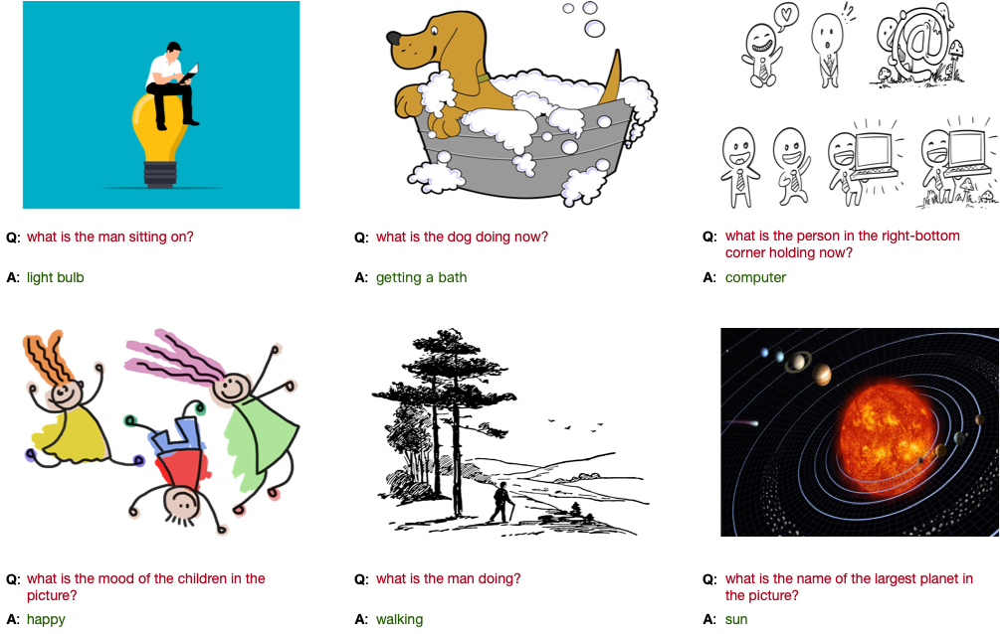
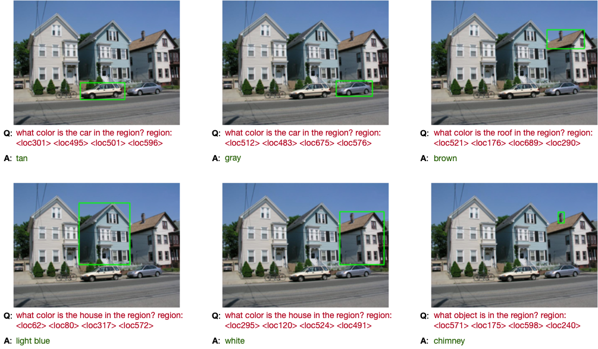
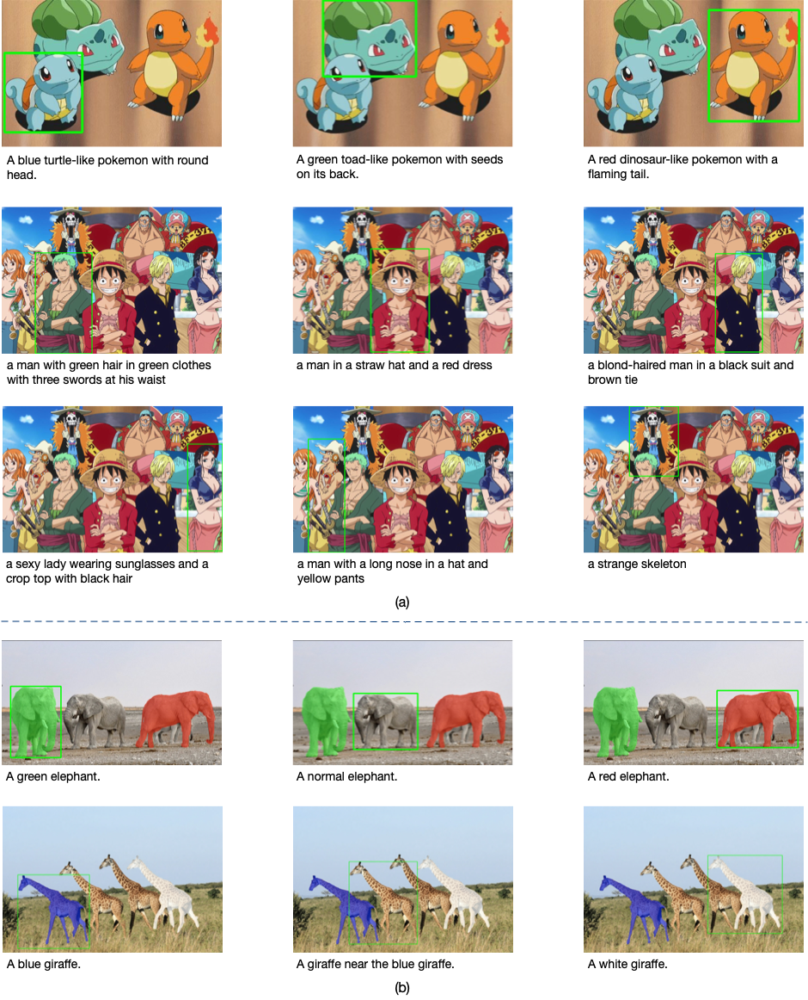

<!---
Copyright 2022 The OFA-Sys Team. 
All rights reserved.
This source code is licensed under the Apache 2.0 license found in the LICENSE file in the root directory.
-->

<p align="center">
    <br>
    
    <br>
<p>
<br>

<p align="center">
        <a href="modelscope.md">ModelScope</a>&nbsp ｜ &nbsp<a href="checkpoints.md">Checkpoints</a>&nbsp ｜ &nbsp<a href="colab.md">Colab</a>&nbsp ｜ &nbsp<a href="https://huggingface.co/ofa-sys">Demo</a>&nbsp ｜ &nbsp<a href="http://arxiv.org/abs/2202.03052">Paper </a>&nbsp ｜ &nbspBlog
</p>

<p align="center">
    <br>
    
    <br>
<p>

[colab]: <https://colab.research.google.com/assets/colab-badge.svg>

OFA is a unified sequence-to-sequence pretrained model (support **English** and **Chinese**) that unifies modalities (i.e., cross-modality, vision, language) and tasks (**finetuning** and **prompt tuning** are supported): image captioning (1st at the [MSCOCO Leaderboard](https://competitions.codalab.org/competitions/3221#results)), VQA ([link](https://eval.ai/web/challenges/challenge-page/830/leaderboard/2278)), visual grounding, text-to-image generation, text classification, text generation, image classification, etc. We provide **step-by-step** instructions for pretraining and finetuning and corresponding checkpoints (check official ckpt \[[EN](checkpoints.md)|[CN](checkpoints_cn.md)\] or [Hugging Face ckpt](https://huggingface.co/OFA-Sys)).

We sincerely welcome contributions to our project. Feel free to contact us or send us issues / PRs!
<br></br>


# Online Demos
We provide online demo via Hugging Face Spaces for you to interact with our pretrained and finetuned models. Below are the links to the demos:
* Image Captioning \[[ModelScope](https://modelscope.cn/#/models/damo/ofa_image-caption_coco_large_en/summary)  |  [Spaces](https://huggingface.co/spaces/OFA-Sys/OFA-Image_Caption)\]
* Visual Grounding \[[ModelScope](https://modelscope.cn/#/models/damo/ofa_visual-grounding_refcoco_large_en/summary) | [Spaces](https://huggingface.co/spaces/OFA-Sys/OFA-Visual_Grounding)\]
* Visual Question Answering \[[ModelScope](https://modelscope.cn/#/models/damo/ofa_visual-question-answering_pretrain_large_en/summary) | [Spaces](https://huggingface.co/spaces/OFA-Sys/OFA-Visual_Question_Answering)\]
* Text-to-Image Generation \[[ModelScope](https://modelscope.cn/#/models/damo/ofa_text-to-image-synthesis_coco_large_en/summary) | [Spaces](https://huggingface.co/spaces/OFA-Sys/OFA-Text2Image_Generation)\]
* Generic Interface \[[Spaces](https://huggingface.co/spaces/OFA-Sys/OFA-Generic_Interface)\]
* Chinese OCR \[[ModelScope](https://modelscope.cn/studios/damo/ofa_ocr_pipeline/summary)  |  [Spaces](https://huggingface.co/spaces/OFA-Sys/OFA-OCR)\]


Also we provide Colab notebooks for you to better perceive the procedures. Click [here](colab.md) to check them out!
<br></br>

# Use in Hugging Face Transformers
We support the inference of OFA in Hugging Face Transformers. Check the [README](transformers.md) and [Colab Notebook](https://colab.research.google.com/drive/1Ho81RBV8jysZ7e0FhsSCk_v938QeDuy3?usp=sharing) for more information. Codes are released in this branch https://github.com/OFA-Sys/OFA/tree/feature/add_transformers
<br><br>


# News
* 2023.1.11: Released MuE (https://arxiv.org/abs/2211.11152), which significantly accelerates OFA with little performance degradation. Many thanks to the first author, Shengkun Tang (@Tangshengku). See the branch `feature/MuE` and [PR](https://github.com/OFA-Sys/OFA/pull/336) for more information.
* 2022.12.20: Released OFA-OCR, a model for Chinese text recognition based on OFA. Check our [paper](https://arxiv.org/abs/2212.09297) and [demo](https://modelscope.cn/studios/damo/ofa_ocr_pipeline/summary).
* 2022.12.7: Released the MMSpeech an ASR pre-training method based on OFA. Check our paper [here](https://arxiv.org/abs/2212.00500)! Please see the [README_mmspeech.md](README_mmspeech.md) for further details.
* 2022.8.16: Released the **Chinese** version of OFA. **OFA-CN** needs only switching to `bpe_dir=../../utils/BERT_CN_dict` and `bpe=bert` and using our provided Chinese checkpoints in [checkpoints_cn.md](checkpoints_cn.md). Temporarily, we only provide base-size and large-size pretrained checkpoints and finetuned checkpoints on [MUGE Caption](https://tianchi.aliyun.com/muge) and the Chinese version of RefCOCO(-/+/g) (to release soon). 
* 2022.8.5: Released support of **prompt tuning** for OFA. Check our paper [here](https://arxiv.org/abs/2208.02532)! Please see the [prompt_tuning.md](prompt_tuning.md) for further details.
* 2022.7.7: Updated support of OFA on **Hugging Face transformers** (fixed bugs in forward, add sequence generator from Fairseq to ensure performance, etc.). Refer to the doc [transformers.md](transformers.md) and the branch `feature/add_transformers`. 
* 2022.6.17: Released the pretrained checkpoint of **OFA-Huge**. To use it, set `--arch=ofa_huge` in the script.
* 2022.5.15: OFA was accepted by **ICML 2022**

<details>
    <summary><b>More News</b></summary>
    <p>
        <ul>
            <li>2022.4.28: Add support of inference on **Hugging Face transformers**. For how to use it, please refer to the doc [transformers.md](transformers.md) and our [Hugging Face models](https://huggingface.co/OFA-Sys).</li>
            <li>2022.4.16: Released lightweight pretrained models **OFA-Medium** (~93M params) and **OFA-Tiny** (~33M params) in [checkpoints.md](checkpoints.md). To use them, you just need to load the corresponding checkpoint and set `--arch=ofa_medium` or `--arch=ofa_tiny` in the scripts.</li>
            <li>2022.3.23: Added [Encouraging Loss](https://arxiv.org/pdf/2110.06537.pdf) as a feature. See [README_EncouragingLoss.md](README_EncouragingLoss.md). Leveraging this feature, OFA-Large has achieved improved results in both VQA (**test-std acc: 80.67**) and Image Classification (**test acc: 85.6**) recently.</li>
            <li>2022.3.21: Released codes for pretraining OFA.</li>
            <li>2022.3.18: Released the finetuned <b>OFA-Base</b> (~180M parameters) checkpoints and running scripts for vision & language tasks, including: <b>Caption (146.4 CIDEr), VQA (78.07 on test-std), SNLI-VE (89.3 on dev), RefCOCO (90.67 on testA), RefCOCO+ (87.15 on testA) and RefCOCOg (82.31 on test-u)</b>.</li>
            <li>2022.3.11: Released the finetuning & inference code/checkpoints for <b>Gigaword</b>.</li>
            <li>2022.3.08: Released the pretrained checkpoint of <b>OFA-Base</b> in <a href="https://github.com/OFA-Sys/OFA/blob/main/checkpoints.md">checkpoints.md</a>. To use OFA-Base, you just need to load <code>ofa_base.pt</code> and change <code>--arch=ofa_large</code> to <code>--arch=ofa_base</code> in the training scripts.</li>
            <li>2022.3.07: Released the finetuning & inference code/checkpoints for <b>Image Classification</b>, which achieves <b>85.0</b> accuracy on ImageNet-1K, slightly better than reported in OFA paper.</li>
            <li>2022.3.04: Released the finetuning & inference code/checkpoints for <b>Text-to-Image Generation</b>.</li>
            <li>2022.3.03: Released the finetuning & inference code/checkpoints for <b>SNLI-VE</b> and <b>GLUE</b>.</li>
            <li>2022.2.22: Released the finetuning & inference code/checkpoints for <b>Visual Question Answering</b>, which can reproduce <b>the reported VQA accuracy in OFA paper (80.02 on test-std)</b>. Check our results on the <a href="https://eval.ai/web/challenges/challenge-page/830/leaderboard/2278">VQA Challenge</a>.</li>
            <li>2022.2.15: Released finetuning & inference code/checkpoints for <b>Referring Expression Comprehension</b></li>
            <li>2022.2.10: Released the inference code & finetuned checkpoint for <b>Image captioning</b>, which can reproduce <b>the results on COCO Karparthy test split (149.6 CIDEr)</b>. OFA also achieves No.1 on the COCO image captioning online leaderboard <a href='https://competitions.codalab.org/competitions/3221#results'>Link</a> (marked as M6-Team).</li>
        </ul>
    </p>
</details>
<br></br>


# Model Card
We list the parameters and pretrained checkpoints of OFAs below. For finetuned checkpoints, please refer to [checkpoints.md](checkpoints.md). 

<table border="1" width="100%">
    <tr align="center">
        <th>Model</th><th>Ckpt</th><th>Params</th><th>Backbone</th><th>Hidden size</th><th>Intermediate size</th><th>Num. of heads</th><th>Enc layers</th><th>Dec layers</th>
    </tr>
    <tr align="center">
        <td>OFA<sub>Tiny</sub></td><td><a href="https://ofa-beijing.oss-cn-beijing.aliyuncs.com/checkpoints/ofa_tiny.pt">Download</a></td><td>33M</td><td>ResNet50</td><td>256</td><td>1024</td><td>4</td><td>4</td><td>4</td>
    </tr>
    <tr align="center">
        <td>OFA<sub>Medium</sub></td><td><a href="https://ofa-beijing.oss-cn-beijing.aliyuncs.com/checkpoints/ofa_medium.pt">Download</a></td><td>93M</td><td>ResNet101</td><td>512</td></td><td>2048</td><td>8</td><td>4</td><td>4</td>
    </tr>
    <tr align="center">
        <td>OFA<sub>Base</sub></td><td><a href="https://ofa-beijing.oss-cn-beijing.aliyuncs.com/checkpoints/ofa_base.pt">Download</a></td><td>180M</td><td>ResNet101</td><td>768</td></td><td>3072</td><td>12</td><td>6</td><td>6</td>
    </tr>
    <tr align="center">
        <td>OFA<sub>Large</sub></td><td><a href="https://ofa-beijing.oss-cn-beijing.aliyuncs.com/checkpoints/ofa_large.pt">Download</a></td><td>470M</td><td>ResNet152</td><td>1024</td></td><td>4096</td><td>16</td><td>12</td><td>12</td>
    </tr>
    <tr align="center">
        <td>OFA<sub>Huge</sub></td><td><a href="https://ofa-beijing.oss-cn-beijing.aliyuncs.com/checkpoints/ofa_huge.pt">Download</a></td><td>930M</td><td>ResNet152</td><td>1280</td></td><td>5120</td><td>16</td><td>24</td><td>12</td>
    </tr>
</table>
<br></br>

# Results
Below we demonstrate the results of OFAs on cross-modal understanding and generation. 

<table border="1" width="100%">
    <tr align="center">
        <th>Task</th><th>Image Captioning</th><th>VQA</th><th>Visual Entailment</th><th colspan="3">Referring Expression Comprehension</th>
    </tr>
    <tr align="center">
        <td>Dataset</td><td>COCO</td><td>VQA v2</td><td>SNLI-VE</td><td>RefCOCO</td><td>RefCOCO+</td><td>RefCOCOg</td>
    </tr>
    <tr align="center">
        <td>Split</td><td>Karpathy test (CE/CIDEr)</td><td>test-dev/test-std</td><td>val/test</td><td>val/test-a/test-b</td><td>val/test-a/test-b</td><td>val-u/test-u</td>
    </tr>
    <tr align="center">
        <td>Metric</td><td>CIDEr</td><td>Acc.</td><td>Acc.</td><td colspan="3">Acc.</td>
    </tr>
    <tr align="center">
        <td>OFA<sub>Tiny</sub></td><td>119.0 / 128.7</td><td>70.3 / 70.4</td><td>85.3 / 85.2</td><td>80.20 / 84.07 / 75.00</td><td>68.22 / 75.13 / 57.66</td><td>72.02 / 69.74</td>
    </tr>
    <tr align="center">
        <td>OFA<sub>Medium</sub></td><td>130.4 / 140.3</td><td>75.4 / 75.5</td><td>86.6 / 87.0</td><td>85.34 / 87.68 / 77.92</td><td>76.09 / 83.04 / 66.25</td><td>78.76 / 78.58</td>
    </tr>
    <tr align="center">
        <td>OFA<sub>Base</sub></td><td>138.2 / 146.7</td><td>78.0 / 78.1</td><td>89.3 / 89.2</td><td>88.48 / 90.67 / 83.30</td><td>81.39 / 87.15 / 74.29</td><td>82.29 / 82.31</td>
    </tr>
    <tr align="center">
        <td>OFA<sub>Large</sub></td><td>142.2 / 150.7</td><td>80.4 / 80.7</td><td>90.3 / 90.2</td><td>90.05 / 92.93 / 85.26</td><td>85.80 / 89.87 / 79.22</td><td>85.89 / 86.55</td>
    </tr>
    <tr align="center">
        <td>OFA<sub>Huge</sub></td><td>145.3 / 154.9</td><td>82.0 / 82.0</td><td>91.0 / 91.2</td><td>92.04 / 94.03 / 88.44</td><td>87.86 / 91.70 / 80.71</td><td>88.07 / 88.78</td>
    </tr>
</table>
<br></br>

# Requirements
* python 3.7.4
* pytorch 1.8.1
* torchvision 0.9.1
* JAVA 1.8 (for COCO evaluation)
<br></br>

# Installation
```bash
git clone https://github.com/OFA-Sys/OFA
pip install -r requirements.txt
```
<br></br>

# Datasets and Checkpoints
See [datasets.md](datasets.md) and [checkpoints.md](checkpoints.md).
<br></br>

# Training & Inference
Below we provide methods for training and inference on different tasks. We provide both pretrained OFA-Large and OFA-Base in [checkpoints.md](checkpoints.md). The scripts mentioned in this section are prepared for OFA-Large. For reproducing the downstreaming results of OFA-Base, we have also provided the corresponding finetuning and inference scripts for OFA-Base in the `run_scripts/` folder.

We recommend that your workspace directory should be organized like this: 
```
OFA/
├── checkpoints/
│   ├── ofa_base.pt
│   ├── ofa_large.pt
│   ├── caption_large_best_clean.pt
│   └── ...
├── criterions/
├── data/
├── dataset/
│   ├── caption_data/
│   ├── gigaword_data/
│   └── ...
├── fairseq/
├── models/
├── run_scripts/
├── tasks/
├── train.py
├── trainer.py
└── utils/
```


## Image Processing
To ensure the efficiency of processing data, we did not store images with small files, but instead we encode them to base64 strings.
Transforming image files to base64 strings is simple. Run the following code:
```python
from PIL import Image
from io import BytesIO
import base64

img = Image.open(file_name) # path to file
img_buffer = BytesIO()
img.save(img_buffer, format=img.format)
byte_data = img_buffer.getvalue()
base64_str = base64.b64encode(byte_data) # bytes
base64_str = base64_str.decode("utf-8") # str
```

## Pretraining
Below we provide methods for pretraining OFA.

<details>
    <summary><b>1. Prepare the Dataset</b></summary>
    <p>
        To pretrain OFA, you should first download the dataset we provide (<a href="https://ofa-beijing.oss-cn-beijing.aliyuncs.com/datasets/pretrain_data/pretrain_data_examples.zip">pretrain_data_examples.zip</a>, a small subset of the original pretraining data). For your customed pretraining datasets, please prepare your training samples into the same format. <code>pretrain_data_examples.zip</code> contains 4 TSV files: <code>vision_language_examples.tsv</code>, <code>text_examples.tsv</code>, <code>image_examples.tsv</code> and <code>detection_examples.tsv</code>. Details of these files are as follows: 
        <br />
        <ul type="circle">
            <li><b>vision_language_examples.tsv</b>:
    Each line contains uniq-id, image (base64 string), caption, question, answer, ground-truth objects (objects appearing in the caption or question), dataset name (source of the data) and task type (caption, qa or visual gronunding). Prepared for the pretraining tasks of visual grounding, grounded captioning, image-text matching, image captioning and visual question answering. </li>
            <li><b>text_examples.tsv</b>: Each line contains uniq-id and text. Prepared for the pretraining task of text infilling. </li> 
            <li><b>image_examples.tsv</b>: Each line contains uniq-id, image (base64 string, should be resized to 256*256 resolution) and image-code (generate the sparse codes for the central part of image through VQ-GAN). Prepared for the pretraining task of image infilling. </li>
            <li><b>detection_examples.tsv</b>: Each line contains uniq-id, image (base64 string) and bounding box annotations (contains the top-left and bottom-right coordinates of the bounding box, object_id and object_name, seperated by commas). Prepared for the pretraining task of detection. </li>
        </ul>
        In addition, the folder negative_sample in pretrain_data_examples.zip contains three files <code>all_captions.txt</code>, <code>object.txt</code> and <code>type2ans.json</code>. The data in these files are used as negative samples for the image-text matching (ITM) task.
    </p>
</details>
<details>
    <summary><b>2. Pretraining</b></summary>
    <p>
        By default, the pretraining script will attempt to restore the released pretrained checkpoints of OFA-Base or OFA-Large and perform continuous pretraining. Continuous pretraining is more recommended, which achieves much better results compared with pretraining from scratch. For continuous pretraining, please download the pretrained weights in advance (see <a href='checkpoints.md'>checkpoints.md</a>) and put them in the correct directory <code>OFA/checkpoints/</code>. If not, the pretraining will begin from scratch.
    </p>
<pre>
cd run_scripts/pretraining
bash pretrain_ofa_large.sh # Pretrain OFA-Large. For OFA-Base, use pretrain_ofa_base.sh
</pre>
    <p>
        If the pretrained OFA checkpoint is restored successfully, you will see the following information in the log:
    </p>
<pre>
INFO: Loaded checkpoint ../../checkpoints/ofa_large.pt
</pre>
</details>

## Image Captioning
We provide procedures to reproduce our results of image captioning on our paper below.
<details>
    <summary><b>1. Prepare the Dataset & Checkpoints</b></summary>
    <p>
        Download data (see <a href='datasets.md'>datasets.md</a>) and models (see <a href='checkpoints.md'>checkpoints.md</a>) and put them in the correct directory. The dataset zipfile <code>caption_data.zip</code> contains caption_stage1_train.tsv, caption_stage2_train.tsv, caption_val.tsv and caption_test.tsv. Each image corresponds to only 1 caption in <code>caption_stage1_train.tsv</code> and corresponds to multiple captions in other TSV files (about 5 captions per image). Each line of the dataset represents a caption sample with the following format. The information of uniq-id, image-id, caption, predicted object labels (taken from <a href='https://github.com/pzzhang/VinVL'>VinVL</a>, not used), image base64 string are separated by tabs.
    </p>
<pre>
162365  12455   the sun sets over the trees beyond some docks.  sky&&water&&dock&&pole  /9j/4AAQSkZJ....UCP/2Q==
</pre>
</details>
<details>
    <summary><b>2. Finetuning</b></summary>
    <p>
        Following previous standard practice, we divide the finetuning process of image captioning into two stages. In stage 1, we finetune OFA with cross-entropy loss on 4 NVIDIA-V100 GPUs with 32GB memory (expected to obtain ~139.5 CIDEr on the validation set at this stage). In stage 2, we select the best checkpoint of stage 1 and train with CIDEr optimization on 8 NVIDIA-V100 GPUs. <b>Note that CIDEr optimization is very unstable and requires careful hyperparameter tuning. If you encounter training errors in the stage2 finetuning, you can increase the batch size or reduce the learning rate. If neither of these works, you can directly set </b><code>--freeze-resnet</code><b> to freeze the inner states of batch normalization.</b>
    </p>
<pre>
cd run_scripts/caption
nohup sh train_caption_stage1.sh > train_stage1.out &  # stage 1, train with cross-entropy loss
nohup sh train_caption_stage2.sh > train_stage2.out &  # stage 2, load the best ckpt of stage1 and train with CIDEr optimization 
</pre>
</details>
<details>
    <summary><b>3. Inference</b></summary>
    <p>
        Run the following commands to get your results and evaluate your model.
    </p>
<pre>
cd run_scripts/caption ; sh evaluate_caption.sh  # inference & evaluate
</pre>
</details>

## Text-to-Image Generation 
This part provides procedures for the finetuning and inference of text-to-image generation. See below.

<details>
    <summary><b>1. Prepare the Dataset & Checkpoints</b></summary>
    <p>
        Download data (see <a href="datasets.md">datasets.md</a>) and models (see <a href="checkpoints.md">checkpoints.md</a>) and put them in the correct directory. The dataset zipfile <code>coco_image_gen.zip</code> contains <code>coco_vqgan_train.tsv</code>, <code>coco_vqgan_dev.tsv</code> and <code>coco_vqgan_full_test.tsv</code>. Each line of the dataset represents a sample with the following format. The information of uniq-id, image-code (produced by <a href="https://github.com/CompVis/taming-transformers">vqgan</a>, a list of integers separated by single-whitespaces), lowercased caption are separated by tabs.
    </p>
<pre>
1	6674 4336 4532 5334 3251 5461 3615 2469 ...4965 4190 1846	the people are posing for a group photo.
</pre>
    <p>
        The checkpoint zipfile <code>image_gen_large_best.zip</code> contains <code>image_gen_large_best.pt</code>, <code>vqgan/last.ckpt</code>, <code>vqgan/model.yaml</code> and <code>clip/Vit-B-16.pt</code>. 
    </p>
</details>
<details>
    <summary><b>2. Shuffle the Training Data</b></summary>
    <p>
        (Optional, but achieves better result): If the disk storage is sufficient, we recommend to prepare the shuffled training data for each epoch in advance. 
    </p>
<pre>
cd dataset/image_gen
ln coco_vqgan_train.tsv coco_vqgan_train_1.tsv
for idx in `seq 1 9`;do shuf coco_vqgan_train_${idx}.tsv > coco_vqgan_train_$[${idx}+1].tsv;done # each file is used for an epoch
</pre>
</details>
<details>
    <summary><b>3. Finetuning</b></summary>
    <p>
        Following previous practice, we divide the finetuning process of image generating into two stages. In stage 1, we finetune OFA with cross-entropy loss on 4 8-V100-32G-GPU servers (expected to obtain ~32.5+ CLIP Score on the validation set at this stage). In stage 2, we select the last checkpoint of stage 1 and train with CLIP Score optimization on 4 8-V100-32G-GPU servers (expected to obtain ~34.0+ CLIP Score on the validation set at this stage). During the validation, the generated image will be dumped into <code>_GEN_IMAGE_PATH_</code>. 
    </p>
<pre>
# run on each worker after the distributed and data configs have been correctly set following the guide in train_image_gen_stage1_distributed.sh 
cd run_scripts/image_gen
nohup sh train_image_gen_stage1_distributed.sh # stage 1, train with cross-entropy loss
nohup sh train_image_gen_stage2_distributed.sh # stage 2, load the last ckpt of stage1 and train with CLIP Score optimization 
</pre>
</details>
<details>
    <summary><b>4. Inference</b></summary>
    <p>
        Run the command below to generate your images. 
    </p>
<pre>
cd run_scripts/image_gen ; sh evaluate_image_gen.sh  # inference & evaluate (FID, IS and CLIP Score)
</pre>
</details>

## Visual Question Answering
Here we provide the finetuning and inference codes to reproduce the VQAv2 result reported in our paper (**test-std 80.02**). We believe much improvement on accuracy can still be achieved based on this codebase :)
<details>
    <summary><b>1. Prepare the Dataset & Checkpoints</b></summary>
    <p>
        Download data (see <a href="datasets.md">datasets.md</a>) and models (see <a href="checkpoints.md">checkpoints.md</a>) and put them in the correct directory. The dataset zipfile <code>vqa_data.zip</code> is around 100G and the decompressed data costs around 135G disk storage, which contains the training, validation and testing samples together with other necessary data resources. (Since <code>vqa_data.zip</code> is large in size, we have also provided chunked parts of the dataset files for more convenient and stable downloading. Please refer to <a href="https://github.com/OFA-Sys/OFA/issues/68#issuecomment-1096837349">issue #68</a>.) Following common practice, VG-QA samples are also included in the training data. To adapt to the seq2seq paradigm of OFA, we transform original VQA training questions with multiple golden answers into multiple training samples. For the original VQA validation set, we keep around 10k samples for our validation and utilize the other samples for training. Each line of the dataset represents a VQA sample with the following format. The information of question-id, image-id, question, answer (with confidence), predicted object labels (taken from <a href="https://github.com/pzzhang/VinVL">VinVL</a>, slightly brings around +0.1 accuracy improvement), image base64 string are separated by tabs. 
    </p>
<pre>
79459   79459   is this person wearing shorts?  0.6|!+no    house&&short&&...&&sky  /9j/4AAQS...tigZ/9k=
</pre>
    <p>
        For fine-tuning on customed VQA-formulated tasks, please refer to issue <a href="https://github.com/OFA-Sys/OFA/issues/76">#76</a>, <a href="https://github.com/OFA-Sys/OFA/issues/105">#105</a> and <a href="https://github.com/OFA-Sys/OFA/issues/73">#73</a> for more information.
    </p>
</details>
<details>
    <summary><b>2. Shuffle the Training Data</b></summary>
    <p>
        (Optional, but achieves better finetuning accuracy): If the disk storage is sufficient, we recommend to prepare the shuffled training data for each epoch in advance. In our experiments, we use shuffling which brings around <b>+0.3</b> improvement on VQA accuracy.
    </p>
<pre>
cd dataset/vqa_data
ln vqa_train.tsv vqa_train_1.tsv
for idx in `seq 1 9`;do shuf vqa_train_${idx}.tsv > vqa_train_$[${idx}+1].tsv;done # each file is used for an epoch
</pre>
</details>
<details>
    <summary><b>3. Finetuning</b></summary>
    <p>
        In our experiments, the VQA finetuning is performed on 4 8-A100-GPU servers (<i>with RDMA</i>). Here provides the finetuning script <code>train_vqa_distributed.sh</code>, which supports multi-server distributed training (as well as single-server training). Please refer to the comments in the beginning of the script and set the configs correctly according to your distribution environment. If you have shuffled the training data in the previous step, please correctly specify the training data path following the guide in the script comments. <b>The command should be run on each worker.</b> 
    </p>
<pre>
# run on each worker after the distributed and data configs have been correctly set following the guide in train_vqa_distributed.sh 
cd run_scripts/vqa
bash train_vqa_distributed.sh 
</pre>
    <p>
        In our experiments, the finetuning costs around 36 hours (for 12 epochs). After each epoch, an evaluation on validation set is performed. The best validation accuracy during finetuning will be around 80.8. The log is saved in <code>${log_dir}</code>.
    </p>
    <p>
        <i>(Update on validation time-cost)</i> As will be mentioned in the <i>4. Inference</i> section, we prepare 2 types of inference: beam-search and all-candidate inference. By default, all-candidate inference is used for validation during fine-tuning, which achieves better accuracy but costs much time. Now we have added a new option in the training scripts called <code>--val-inference-type</code> to switch the validation inference type during fine-tuning. If you feel the validation takes too long, you can refer to <a href="https://github.com/OFA-Sys/OFA/pull/79">PR #79</a> to activate beam-search validation, which significantly takes much less time, with around 0.5-0.6 validation score degradation compared with all-candidate validation.
    </p>
</details>
<details>
    <summary><b>4. Inference</b></summary>
    <p>
        We provide 2 types of inference, <b>beam-search</b> (much faster but gets sub-optimal accuracy) and <b>all-candidate evaluation</b> (slower but best accuracy). <br></br>
        For beam-search inference, use the script <code>evaluate_vqa_beam.sh</code>. Refer to the command below. The inference on test set costs around 16 GPU hours. After inference on test set, the result JSON file will be dumped in the <code>${result_path}</code> defined in the shell script. You can submit the result <code>test_predict.json</code> to <a href="https://eval.ai/web/challenges/challenge-page/830/overview">EvalAI</a>. Using our released finetuned checkpoint, beam-search inference will get 80.15 validation accuracy, 79.36 test-dev accuracy and 79.48 test-std accuracy (around 0.6 lower than all-candidate evaluation).
    </p>
<pre>
cd run_scripts/vqa
bash evaluate_vqa_beam.sh val # specify 'val' or 'test'
</pre>
    <p>
        For all-candidate evaluation, we recommend to use the distributed script <code>evaluate_vqa_allcand_distributed.sh</code>. Please refer to the guide in the script to set the distributed configs before running. The result JSON file will be dumped in the <code>${result_path}</code> defined in the shell script of rank-0 server. All-candidate evaluation computes scores on all the candidate answers in the VQA dataset, which achieves <b>80.82</b> validation accuracy, <b>79.87</b> test-dev accuracy and <b>80.02</b> test-std accuracy, reproducing our reported results in the paper. However, the inference on test set costs around 1k GPU hours, which is much slower.
    </p>
<pre>
# run on each worker after the distributed configs have been correctly set following the guide in evaluate_vqa_allcand_distributed.sh
cd run_scripts/vqa
bash evaluate_vqa_allcand_distributed.sh val # specify 'val' or 'test'
</pre>
</details>

## Visual Grounding (Referring Expression Comprehension)
Here provides procedures for you to prepare data, train, and evaluate your model on visual grounding. 
<details>
    <summary><b>1. Prepare the Dataset & Checkpoints</b></summary>
    <p>
        Download data (see <a href='datasets.md'>datasets.md</a>) and models (see <a href='checkpoints.md'>checkpoints.md</a>) and put them in the correct directory. We provide RefCOCO (split by UNC), RefCOCO+ (split by UNC) and RefCOCOg (split by UMD) datasets. See <a href='https://www.tensorflow.org/datasets/catalog/ref_coco'>RefCOCO</a> and <a href="https://github.com/lichengunc/refer">Refer</a> for more details. Note that in the original dataset, each region-coord (or bounding box) may corresponds to multiple descriptive texts. We split these texts into multiple samples so that the region-coord in each sample corresponds to only one text. Each line of the processed dataset represents a sample with the following format. The information of uniq-id, image-id, text, region-coord (separated by commas), image base64 string are separated by tabs.
    </p>
<pre>
79_1    237367  A woman in a white blouse holding a glass of wine.  230.79,121.75,423.66,463.06 9j/4AAQ...1pAz/9k=
</pre>
</details>
<details>
    <summary><b>2. Finetuning</b></summary>
    <p>
        Unlike the original paper, we finetune OFA with a drop-path rate of 0.2, and found that training with this hyper-parameter achieves better results. We will update the reported results of the paper later.
    </p>
<pre>
cd run_scripts/refcoco
nohup sh train_refcoco.sh > train_refcoco.out &  # finetune for refcoco
nohup sh train_refcocoplus.sh > train_refcocoplus.out &  # finetune for refcoco+
nohup sh train_refcocog.sh > train_refcocog.out &  # finetune for refcocog
</pre>
</details>
<details>
    <summary><b>3. Inference</b></summary>
    <p>
        Run the following commands for the evaluation. 
    </p>
<pre>
cd run_scripts/refcoco ; sh evaluate_refcoco.sh  # inference & evaluate for refcoco/refcoco+/refcocog
</pre>
</details>

## Visual Entailment
We provide steps for you to reproduce our results in visual entailment. See the details below.

<details>
    <summary><b>1. Prepare the Dataset & Checkpoints</b></summary>
    <p>
        Download data (see <a href="datasets.md">datasets.md</a>) and models (see <a href="checkpoints.md">checkpoints.md</a>) and put them in the correct directory. Each line of the processed dataset represents a sample with the following format. The information of uniq-id, image-id, image base64 string, hypothesis, caption (or text premise), label are separated by tabs.
    </p>
<pre>
252244149.jpg#1r1n  252244149   /9j/4AAQ...MD/2Q==   a man in pink and gold is chewing on a wooden toothpick.   a man in pink is chewing a toothpick on the subway.   neutral 
</pre>
</details>
<details>
    <summary><b>2. Finetuning</b></summary>
    <p>
        In our experiments, the SNLI-VE finetuning is performed on 8 NVIDIA-V100 GPUs with 32GB memory. In this task, we experimented with only a few sets of hyperparameters. We believe that proper hyperparameter tuning can lead to further accuracy improvement.
    </p>
<pre>
cd run_scripts/snli_ve
nohup sh train_snli_ve.sh > train_snli_ve.out &  # finetune for snli_ve
</pre>
</details>
<details>
    <summary><b>3. Inference</b></summary>
    <p>
        Run the following command to obtain the results.
    </p>
<pre>
cd run_scripts/snli_ve ; sh evaluate_snli_ve.sh dev  # specify 'dev' or 'test'
</pre>
</details>
   
## GLUE
Here we provide steps for you to finetune and evaluate our model on language understanding tasks. We demonstrate our practice for the GLUE benchmark. 

<details>
    <summary><b>1. Prepare the Dataset & Checkpoints</b></summary>
    <p>
        Download data (see <a href="datasets.md">datasets.md</a>) and models (see <a href="checkpoints.md">checkpoints.md</a>) and put them in the correct directory. we provide 7 language understanding datasets from GLUE benchmark, including COLA, MNLI, MRPC, QNLI, QQP, RTE and SST2. More details about these datasets can be found in this <a href="https://openreview.net/pdf?id=rJ4km2R5t7">link</a>.
    </p>
</details>
<details>
    <summary><b>2. Finetuning</b></summary>
    <p>
        For each task, we have tried multiple sets of hyperparameters (including learning rate, batch size, training epochs). The results under different sets of hyperparameters can be found in <code>${log_dir}</code>.
    </p>
<pre>
cd run_scripts/glue
nohup sh train_cola.sh > train_cola.out &  # finetune for cola
nohup sh train_mnli.sh > train_mnli.out &  # finetune for mnli
nohup sh train_mrpc.sh > train_mrpc.out &  # finetune for mrpc
nohup sh train_qnli.sh > train_qnli.out &  # finetune for qnli
nohup sh train_qqp.sh > train_qqp.out &  # finetune for qqp
nohup sh train_rte.sh > train_rte.out &  # finetune for rte
nohup sh train_sst2.sh > train_sst2.out &  # finetune for sst2
</pre>
</details>

## Image Classification on ImageNet-1K
We provide the finetuning and inference codes which reproduce **85.0 ImageNet-1K accuracy**, slightly better than reported in our paper. 

<details>
    <summary><b>1. Prepare the Dataset & Checkpoints</b></summary>
    <p>
        Download data (see <a href="datasets.md">datasets.md</a>) and models (see <a href="checkpoints.md">checkpoints.md</a>) and put them in the correct directory. Our provided data is derived from the original <a href="http://image-net.org/">ImageNet-1K</a> (ILSVRC2012 train & validation) dataset and shares the same data split with it. To formulate the classification task into seq2seq paradigm, we use the <a href="https://github.com/HoldenCaulfieldRye/caffe/blob/master/data/ilsvrc12/synset_words.txt">synset words</a> provided by Caffe as the generation target for each image class. Each line of the processed dataset represents a sample with the following format. The information of image base64 string, classification label (1-indexed, conform to the order in <code>synset_words.txt</code>), synset words of the label are separated by tabs.
    </p>
<pre>
_9j_4AAQS...fzX__Z  769 rugby ball
</pre>
</details>
<details>
    <summary><b>2. Shuffle the Training Data</b></summary>
    <p>
        (Optional, but achieves better finetuning accuracy): If the disk storage is sufficient, we recommend to prepare the shuffled training data for each epoch in advance. In our experiments, we use shuffling which brings around <b>+0.2</b> improvement on ImageNet-1K accuracy.
    </p>
<pre>
cd dataset/imagenet_1k_data
ln imagenet_1k_train.tsv imagenet_1k_train_1.tsv
for idx in `seq 1 9`;do shuf imagenet_1k_train_${idx}.tsv > imagenet_1k_train_$[${idx}+1].tsv;done # each file is used for an epoch one by one
</pre>
</details>
<details>
    <summary><b>3. Finetuning</b></summary>
    <p>
        In our experiments, the ImageNet-1K finetuning is performed on 2 8-A100-GPU servers (<i>with RDMA</i>). Here provides the finetuning script <code>train_imagenet_distributed.sh</code>, which supports multi-server distributed training (as well as single-server training). Please refer to the comments in the beginning of the script and set the configs correctly according to your distribution environment. If you have shuffled the training data in the previous step, please correctly specify the training data path following the guide in the script comments. <b>The command should be run on each worker.</b> For quick evaluation during finetuning, by default we sample 20% of the original validation split and report accuracy on this subset after each epoch. The accuracy on the validation subset is generally ±0.1 relative to accuracy on the whole validation split.
    </p>
<pre>
# run on each worker after the distributed and data configs have been correctly set following the guide in train_imagenet_distributed.sh
cd run_scripts/image_classify
bash train_imagenet_distributed.sh
</pre>
    <p>
        In our experiments, the finetuning costs around 80 hours (for 32 epochs). The best accuracy on validation subset during finetuning will be around 85.0. The log is saved in <code>${log_dir}</code>.
    </p>
</details>
<details>
    <summary><b>4. Inference</b></summary>
    <p>
        To get the validation accuracy on the whole ImageNet-1K validation set, run the following command. The evaluation costs around 10 GPU hours. The accuracy will be reported in the stdout (expected to be around <b>85.0</b>).
    </p>
<pre>
cd run_scripts/image_classify ; sh evaluate_imagenet.sh  # inference & evaluate for imagenet-1k
</pre>
</details> 

## Gigaword
We provide steps for you to reproduce our results in Gigaword. See the details below.

<details>
    <summary><b>1. Prepare the Dataset & Checkpoints</b></summary>
    <p>
        Download data (see <a href="datasets.md">datasets.md</a>) and models (see <a href="checkpoints.md">checkpoints.md</a>) and put them in the correct directory. The original dataset is taken from <a href="https://github.com/microsoft/unilm/">UniLM</a> and we organized the data into the tsv format. Each line of the processed dataset represents a sample with the following format. The information of source and target texts are separated by tabs.
    </p>
<pre>
factory orders for manufactured goods rose #.# percent in september...  us september factory orders up #.# percent
</pre>
</details>
<details>
    <summary><b>2. Finetuning</b></summary>
    <p>
        Run the following command to train the model.
    </p>
<pre>
cd run_scripts/gigaword
nohup sh train_gigaword.sh > train_gigaword.out &  # finetune for gigaword
</pre>
</details>
<details>
    <summary><b>3. Inference</b></summary>
    <p>
        Run the following command to obtain the results (~36.43 rougeL).
    </p>
<pre>
cd run_scripts/gigaword ; sh evaluate_gigaword.sh  # inference & evaluate for gigaword
</pre>
</details> 

<br></br>

# Gallery
Below we provide examples of OFA in text-to-image generation and open-ended VQA. Also, we demonstrate its performance in unseen task (Grounded QA) as well as unseen domain (Visual Grounding on images from unseen domains). 

## Text-to-Image Generation


## Open-Ended VQA


## Grounded QA (unseen task)


## Visual Grounding (unseen domain)

<br></br>

# Related Codebase
* [Fairseq](https://github.com/pytorch/fairseq)
* [taming-transformers](https://github.com/CompVis/taming-transformers)
<br></br>


# Getting Involved
Feel free to submit Github issues or pull requests. Welcome to contribute to our project!

To contact us, never hestitate to send an email to `zheluo.wp@alibaba-inc.com` or `junyang.ljy@alibaba-inc.com`!
<br></br>


# Citation
Please cite our paper if you find it helpful :)

```
@article{wang2022ofa,
  author    = {Peng Wang and
               An Yang and
               Rui Men and
               Junyang Lin and
               Shuai Bai and
               Zhikang Li and
               Jianxin Ma and
               Chang Zhou and
               Jingren Zhou and
               Hongxia Yang},
  title     = {OFA: Unifying Architectures, Tasks, and Modalities Through a Simple Sequence-to-Sequence
               Learning Framework},
  journal   = {CoRR},
  volume    = {abs/2202.03052},
  year      = {2022}
}
```
<br></br>
