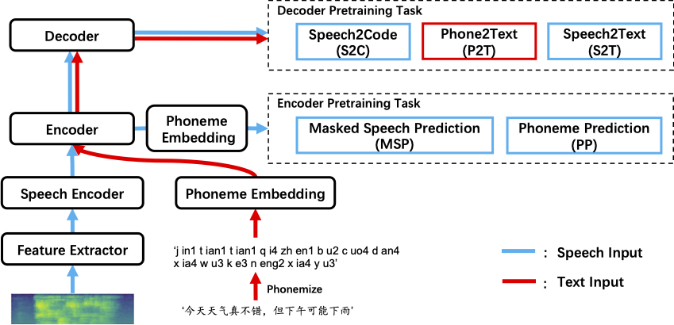

# MMSpeech: Multi-modal Multi-task Encoder-Decoder Pre-training for speech recognition

<p align="center">
        <a href="modelscope.md">ModelScope</a>&nbsp ｜ &nbsp<a href="https://arxiv.org/abs/2212.00500">Paper </a>&nbsp 
</p>

We propose a novel multi-modal multi-task encoder-decoder pre-training framework~(MMSpeech) for Mandarin automatic speech recognition~(ASR), which employs a multi-task learning framework including five self-supervised and supervised tasks with speech and text data. 
Experiments on AISHELL-1 show that our proposed method achieves state-of-the-art performance, with a more than 40% relative improvement compared with other pre-training methods.

<p align="center">
    <br>
    
    <br>
<p>
<br>

## Datasets & Checkpoints
| Model          | Model Size |                  Unlabeled Speech                  |                Unlabeled Text                 |                 labeled                  |                                                      Pre-Training                                                       |                                                       Fine-Tuning                                                       |
|:---------------|:----------:|:--------------------------------------------------:|:---------------------------------------------:|:----------------------------------------:|:-----------------------------------------------------------------------------------------------------------------------:|:-----------------------------------------------------------------------------------------------------------------------:|
| MMSpeech-Base1 |    210M    | [AISHELL-2](https://www.aishelltech.com/aishell_2) | [M6-Corpus](https://arxiv.org/abs/2103.00823) | [AISHELL-1](http://www.openslr.org/33/)  | [checkpoint](https://ofadatain.oss-cn-hangzhou.aliyuncs.com/mmspeech_open_source/github/ofa_mmspeech_base1_pretrain.pt) | [checkpoint](https://ofadatain.oss-cn-hangzhou.aliyuncs.com/mmspeech_open_source/github/ofa_mmspeech_base1_aishell1.pt) |
| MMSpeech-Base2 |    210M    | [WenetSpeech](https://wenet.org.cn/WenetSpeech/)   |                   M6-Corpus                   |                AISHELL-1                 | [checkpoint](https://ofadatain.oss-cn-hangzhou.aliyuncs.com/mmspeech_open_source/github/ofa_mmspeech_base2_pretrain.pt) | [checkpoint](https://ofadatain.oss-cn-hangzhou.aliyuncs.com/mmspeech_open_source/github/ofa_mmspeech_base2_aishell1.pt) |
| MMSpeech-Large |    609M    |                    WenetSpeech                     |                   M6-Corpus                   |                AISHELL-1                 | [checkpoint](https://ofadatain.oss-cn-hangzhou.aliyuncs.com/mmspeech_open_source/github/ofa_mmspeech_large_pretrain.pt) | [checkpoint](https://ofadatain.oss-cn-hangzhou.aliyuncs.com/mmspeech_open_source/github/ofa_mmspeech_large_aishell1.pt) |

## Results on AISHELL-1
- Compare MMSpeech-Base1 with the model of the same encoder size and amount of unlabeled speech data.

| Model                            | dev (w/o LM) | dev (wit LM) | test (w/o LM) | test (with LM) |
|:---------------------------------|:------------:|:------------:|:-------------:|:--------------:|
| w/o pre-training                 |     6.4      |     5.2      |      6.8      |      5.7       |
| Data2Vec                         |     3.8      |     3.7      |      4.1      |      3.9       |
| MMSpeech-Base1                   |     2.4      |     2.1      |      2.6      |      2.3       |
| MMSpeech-Base1 (w/o Fine-Tuning) |     2.5      |     2.3      |      2.6      |      2.3       |

- Compare MMSpeech-Base2 with the model of the same encoder size and amount of unlabeled speech data.

| Model            | dev (wit LM) | test (with LM) |
|:-----------------|:------------:|:--------------:|
| Wav2vec 2.0-Base |     4.2      |      4.7       |
| HuBERT-Base      |     4.1      |      4.3       |
| MMSpeech-Base2   |     2.0      |      2.1       |

- Compare MMSpeech-Large with the model of the same encoder size and amount of unlabeled speech data.

| Model             | dev (wit LM) | test (with LM) |
|:------------------|:------------:|:--------------:|
| Wav2vec 2.0-Large |     3.8      |      4.1       |
| HuBERT-Large      |     3.1      |      3.3       |
| MMSpeech-Large    |     1.6      |      1.9       |


## Quick start
### Installation

Note that we update the fairseq version for mmspeech.

```bash
git clone https://github.com/OFA-Sys/OFA
pip install -r requirements.txt
```

### Data preparation

Input files for all tasks include three columns: "speech_id, wav_path, text", delimited by a "\t". 
- "wav_path" denotes the path for the wav files.
- "text" denotes raw text inputs.
- "pseduo-codes" can be obtained by following the steps in [wav2seq](https://github.com/asappresearch/wav2seq).

| Data                  |   Task   | speech_id_col | wav_path_col |   text_col   |
|:----------------------|:--------:|:-------------:|:------------:|:------------:|
| unlabeled speech data | S2C, MSP |   speech_id   |   wav_path   | pseduo-codes |
| unlabeled text data   |   P2T    |   speech_id   |   un-used    |     text     |
| speech-text data      |   S2T    |   speech_id   |   wav_path   |     text     |

We also provide example config_yaml of input fbank features for your reference in [here](http://ofadatain.oss-cn-hangzhou.aliyuncs.com/mmspeech_open_source/github/data/fbank_config.yaml).

### training
```commandline
cd run_scripts/mmspeech
sh mmspeech_cn_base_stage1.sh
sh mmspeech_cn_base_stage2.sh
sh mmspeech_cn_base_stage3.sh
```
### evaluation
```commandline
cd run_scripts/mmspeech
sh evaluate_mmspeech_base.sh
```
